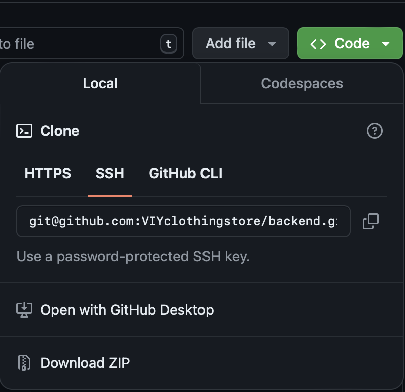

# **SPORT HUB STORE**

### [SPORT HUB](https://teamchallenge-sport-store-frontend.vercel.app) is an e-commerce platform for hassle-free shopping.

### In this project implemented:

##### - Catalog of goods: structure of presentation, search, sorting, filters of goods.

#### - Shopping cart and placing an order: adding goods to the basket, and placing a purchase.

#### - User profile: possibility of registration, authorization, and management of personal data.

#### - Admin panel: interface for managing the store, adding products, categories, users, etc.

#### - Integration with API NOVA POST: automatic branch search.


## Stack:

[](https://skillicons.dev)

## Installation:

### Clone this repository using GitHub Desktop:



## Preparations:

### .env:

Please, make sure that you have a .env in the root folder. Feel free to specify values of environmental variables as you
wish, but make sure that your .env file structured like .env.example.

## Start develop with Docker:

Firstly, you need to have Docker installed in your system. If you haven't installed Docker yet,
visit https://docs.docker.com/get-docker/ .

## Commands:

- To list available commands for make:
  ```shell
  $ make

  Please use `make <target>' where <target> is one of
  build_and_run             Run and build application
  drop_all_containers       Drop all containers
  help                      Display help message
  migrate                   Make migrate
  open_log                  Open api log
  open_shell                Open shell to the app container
  run_app                   Run application
  run_migrate               Run migrate
  super_user                Make super user
  ```

- Run and build application:

      make build_and_run

- Run application:

      make build_and_run

- Drop all containers:

      make drop_all_containers    

- Create super user:

      make_super_user 

- Show api logs:

      make_open_log

## DB migration:

- Make migrations of the DB:

      make migrate

- Migrate the DB:

      make run_migrate

## Poetry:

In this project used [Poetry](https://python-poetry.org/) environment

- Load all needed packages

      poetry install

- Add new package

      poetry add <package_name>

## Swagger:

- Show OpenApi schema

      http://host:port/swagger/

## Deployment:

We chose [Google Cloud Platform](https://cloud.google.com) to deploy our project

## Contributors:

- [Vita Yushchyk](https://github.com/vitayushchyk)
- [Mykola Chaiun](https://github.com/KolyaChaun)
